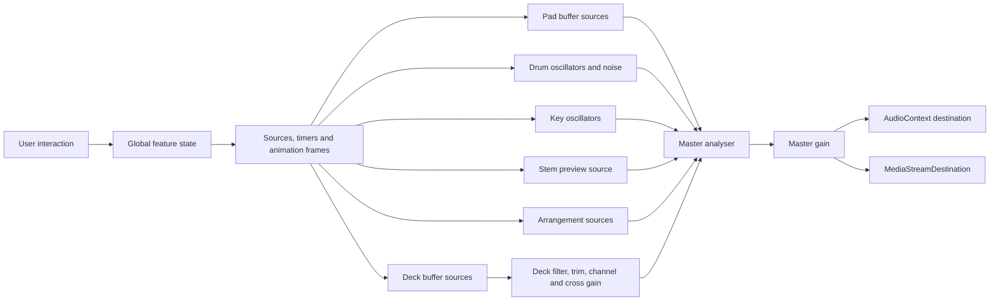

# Audio engine map

## Core graph

`AudioEngine.init` lazily creates one `AudioContext`, a `MediaStreamDestination` for recording, a master analyser and a master gain. The analyser feeds the master gain, which connects to speakers and the recorder destination. Audio resumes only after Start Audio or another function explicitly calls initialization.

Playback ownership is coordinated by `src/audio/playback-registry.js`. The registry does not replace feature audio graphs. It reads live feature state and invokes their existing lifecycle callbacks.

## Owners and scheduling

- Decks own a decoded buffer, current source, filter, gain, cross gain, offset, start time, playback flags, loop and selection data. A new `AudioBufferSourceNode` is created for each play or seek.
- Smart Mix owns transition plans, active and prepared decks, timers, animation frames and pitch/filter/fader changes. It uses both deck graphs.
- Pads own up to 16 buffers and active source references. Quantization calculates the next trigger time from context time and global BPM.
- Drums use a recursive timeout sequencer. Each tick schedules oscillator or noise nodes for kick, sub, snare, hat and clap.
- Keys create oscillator groups with gain envelopes. Active voices are tracked for global stopping.
- Stems use a single preview source and gain. Server output is decoded into memory. Browser fallback runs `OfflineAudioContext` filters.
- Editor schedules deck-like buffers, recorded drum events, key events and pad events, and stores scheduled nodes for stop.
- Crate preview and URL actions use decoded buffers and preview helpers. Their exact source ownership overlaps general preview paths and requires manual stop testing.
- Mix recording captures everything routed through the master analyser into `MediaStreamDestination`.

## Master volume and crossfader

The Master control updates a dedicated master gain node after the analyser. Each deck gain is trim multiplied by channel fader. Crossfader uses per-deck cross gains with an equal-power curve. Non-deck systems connect to the master analyser and bypass the crossfader.

## Global transport and stop

The persistent header transport reads live source state from `AudioPlaybackRegistry`. Space plays or pauses contextually, Shift+Space restarts the primary active source and Escape invokes the same authoritative `stopAllAudio` path as the visible Stop All Audio button. The registry isolates source cleanup errors so one failed callback does not prevent the remaining registered sources from stopping. Overlapping audio and recording cleanup still require manual browser testing.

## Cleanup and navigation

View navigation only changes CSS classes. It intentionally does not stop audio. Buffer source cleanup relies on `stop`, `onended` and feature-specific arrays. Object URLs are revoked for replaced recordings and WAV downloads. Generated stem jobs remain on disk. No `beforeunload` cleanup exists.

## Risks

- Audio can continue after navigation by design. The header reports active ownership and navigation tabs indicate views with active audio, but this behavior requires manual verification.
- Smart Mix combines timeouts and animation frames in one timer collection. Cancellation correctness is high risk.
- One master analyser is also the routing splitter. There is no limiter, master gain, mute or clipping protection.
- Cue monitor has no separate output bus.
- Scratch creates many short sources. Source lifecycle and CPU use need testing.
- Key voices, pad loops, preview nodes and editor nodes can become stuck if an exception interrupts cleanup.
- Drum scheduling uses `setTimeout`, which is vulnerable to main-thread jitter.
